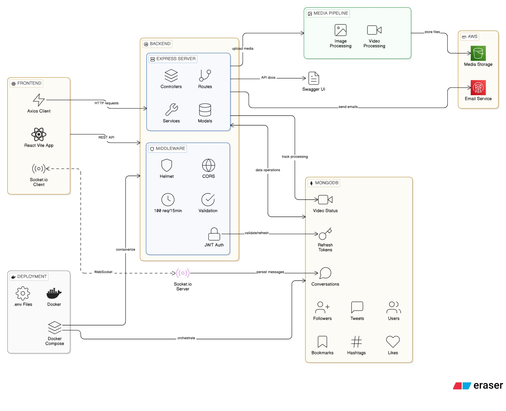

# Twitter Clone - Full Stack Application

A full-featured Twitter/X clone built with **Node.js + Express** (backend) and **React + Vite** (frontend), featuring real-time messaging, tweet management, media uploads, and user interactions.



---

## 🌟 Features

### User Management

- User registration and authentication with JWT
- Email verification system
- Password reset functionality
- User profiles with bio, location, website, avatar, and cover photo
- Follow/unfollow system with Twitter Circle (private network)

### Tweets & Content

- Create, read, update, and delete tweets
- Tweet types: Tweet, Retweet, Comment, QuoteTweet
- Audience control: Public, Followers, Twitter Circle, Private
- Hashtag support and mentions
- Media attachments (images and videos)
- View tracking (guest and user views)

### Social Features

- **Likes** - Like/unlike tweets
- **Bookmarks** - Save tweets for later
- **Comments & Replies** - Thread-based conversations
- **Search** - Full-text search for tweets and users
- **Real-time Messaging** - Socket.io powered conversations

### Media Management

- Image upload and processing with Sharp
- Video upload with FFmpeg transcoding
- AWS S3 integration for cloud storage
- Video status tracking

### Security & Performance

- JWT-based authentication with access/refresh tokens
- Rate limiting (100 requests per 15 minutes)
- Password encryption
- CORS for cross-origin requests
- Helmet for security headers
- Email verification for account security

### API Documentation

- Swagger UI integration at `/node-js/api-docs`
- OpenAPI specification in `twitter-swagger.yaml`

---

## 🛠️ Tech Stack

### Backend

- **Runtime**: Node.js 20.x
- **Language**: TypeScript
- **Framework**: Express.js
- **Database**: MongoDB
- **Authentication**: JWT (JSON Web Tokens)
- **Real-time**: Socket.io
- **Media Processing**: Sharp (images), FFmpeg (videos)
- **Cloud Storage**: AWS S3
- **Email**: AWS SES
- **Validation**: Express Validator
- **Rate Limiting**: express-rate-limit
- **Security**: Helmet, CORS

### Frontend

- **Framework**: React 19
- **Build Tool**: Vite
- **Language**: JavaScript (JSX)
- **Routing**: React Router DOM
- **HTTP Client**: Axios
- **Real-time**: Socket.io Client
- **Video Player**: Vidstack React, HLS.js

### DevOps

- **Containerization**: Docker & Docker Compose
- **Package Manager**: npm
- **Code Quality**: ESLint, Prettier

---

## 📁 Project Structure

```
├── src/                          # Backend source code
│   ├── controllers/              # Request handlers
│   ├── services/                 # Business logic & DB operations
│   ├── routes/                   # API routes
│   ├── models/                   # Data schemas & types
│   │   ├── schemas/              # MongoDB schemas
│   │   └── requests/             # Request validation models
│   ├── middlewares/              # Express middlewares
│   ├── utils/                    # Helper functions
│   ├── constants/                # Configuration constants
│   └── templates/                # Email templates
│
├── client/                       # Frontend source code (React + Vite)
│   ├── src/
│   │   ├── components/           # React components
│   │   ├── pages/                # Page components
│   │   ├── router.jsx            # Route definitions
│   │   └── socket.js             # Socket.io setup
│   └── public/                   # Static assets
│
├── Dockerfile                    # Backend container configuration
├── docker-compose.yml            # Multi-container setup
├── tsconfig.json                 # TypeScript configuration
├── eslint.config.mjs             # ESLint rules
├── nodemon.json                  # Nodemon configuration
├── twitter-swagger.yaml          # API documentation
└── package.json                  # Backend dependencies
```

---

## 🚀 Getting Started

### Prerequisites

- **Node.js** 20.x or higher
- **MongoDB** (local or cloud)
- **npm** or **yarn**
- **AWS Credentials** (for S3 & SES)
- **Environment Variables** (.env.development, .env.production, etc.)

### Backend Setup

1. **Install Dependencies**

   ```bash
   npm install
   ```

2. **Environment Configuration**
   Create `.env.development` (or `.env.production`, `.env.staging`):

   ```env
   # Server
   PORT=4000
   HOST=localhost

   # Database
   DB_NAME=twitter
   DB_USERNAME=your_mongo_user
   DB_PASSWORD=your_mongo_password
   DB_USERS_COLLECTION=users
   DB_REFRESH_TOKENS_COLLECTION=refresh_tokens
   DB_FOLLOWERS_COLLECTION=followers
   DB_VIDEO_STATUS_COLLECTION=video_status
   DB_TWEETS_COLLECTION=tweets
   DB_HASHTAGS_COLLECTION=hashtags
   DB_BOOKMARKS_COLLECTION=bookmarks
   DB_LIKES_COLLECTION=likes
   DB_CONVERSATIONS_COLLECTION=conversations

   # JWT Secrets (generate with: openssl rand -base64 32)
   JWT_SECRET_ACCESS_TOKEN=your_access_token_secret
   JWT_SECRET_REFRESH_TOKEN=your_refresh_token_secret
   JWT_SECRET_EMAIL_VERIFY_TOKEN=your_email_verify_token_secret
   JWT_SECRET_FORGOT_PASSWORD_TOKEN=your_forgot_password_token_secret
   JWT_DEFAULT_SECRET_TOKEN=your_default_secret_token
   PASSWORD_SECRET=your_password_secret

   # Token Expiration
   ACCESS_TOKEN_EXPIRES_IN=1h
   REFRESH_TOKEN_EXPIRES_IN=30d
   EMAIL_VERIFY_TOKEN_EXPIRES_IN=7d
   FORGOT_PASSWORD_TOKEN_EXPIRES_IN=15m

   # Google OAuth (optional)
   GOOGLE_CLIENT_ID=your_google_client_id
   GOOGLE_CLIENT_SECRET=your_google_client_secret
   GOOGLE_REDIRECT_URI=your_redirect_uri
   CLIENT_REDIRECT_CALLBACK=your_client_callback_url
   CLIENT_URL=http://localhost:5173

   # AWS Configuration
   AWS_ACCESS_KEY_ID=your_access_key
   AWS_SECRET_ACCESS_KEY=your_secret_key
   AWS_REGION=us-east-1
   S3_BUCKET_NAME=your_bucket_name
   SES_FROM_ADDRESS=noreply@yourdomain.com
   ```

3. **Build the Project**

   ```bash
   npm run build
   ```

4. **Run in Development**

   ```bash
   npm run dev           # Development mode
   npm run dev:prod      # Production mode
   npm run dev:stage     # Staging mode
   ```

5. **Run in Production**
   ```bash
   npm start             # Development
   npm run start:prod    # Production
   npm run start:stage   # Staging
   ```

### Frontend Setup

1. **Install Dependencies**

   ```bash
   cd client
   npm install
   ```

2. **Run Development Server**

   ```bash
   npm run dev
   ```

   Frontend will be available at `http://localhost:5173`

3. **Build for Production**
   ```bash
   npm run build
   ```

---

## 🐳 Docker Setup

### Using Docker Compose

```bash
docker-compose up --build
```

This starts:

- **Backend**: `http://localhost:4000`
- **API Docs**: `http://localhost:4000/node-js/api-docs`
- **Uploads**: Mounted to `/d/DockerVolume`

### Building Docker Image Manually

```bash
docker build -t twitter-app:latest .
docker run -p 4000:4000 \
  -v /path/to/uploads:/app/uploads \
  -e PORT=4000 \
  -e DB_NAME=twitter \
  twitter-app:latest
```

---

## 📚 API Endpoints

Access the full API documentation via Swagger UI:

```
http://localhost:4000/node-js/api-docs
```

### Main Routes

- `/users` - User management (register, login, profile)
- `/tweets` - Tweet operations (CRUD)
- `/medias` - Media upload and processing
- `/bookmarks` - Bookmark management
- `/likes` - Like functionality
- `/search` - Search tweets and users
- `/conversations` - Real-time messaging
- `/static/video` - Video file serving

---

## 🔐 Authentication

The backend uses **JWT-based authentication** with multiple token types:

1. **Access Token** - Short-lived (1 hour), for API requests
2. **Refresh Token** - Long-lived (30 days), for refreshing access tokens
3. **Email Verify Token** - For email verification (7 days)
4. **Forgot Password Token** - For password reset (15 minutes)

### Protected Routes

Most API endpoints require a valid access token in the `Authorization` header:

```
Authorization: Bearer <access_token>
```

---

## 📝 Code Quality

### Linting & Formatting

```bash
# Check code style
npm run lint

# Fix code style
npm run lint:fix

# Check formatting
npm run prettier

# Format code
npm run prettier:fix
```

---

## 🗄️ Database Collections

MongoDB collections structure:

- **users** - User accounts and profiles
- **refresh_tokens** - Token management
- **followers** - Follow relationships
- **tweets** - Tweet documents
- **hashtags** - Hashtag references
- **bookmarks** - Bookmarked tweets
- **likes** - Tweet likes
- **conversations** - Direct messages
- **video_status** - Video processing status

---

## 📦 Key Dependencies

### Backend

- `express` - Web framework
- `mongodb` - Database driver
- `jsonwebtoken` - JWT authentication
- `socket.io` - Real-time communication
- `sharp` - Image processing
- `@aws-sdk/*` - AWS services
- `axios` - HTTP client
- `express-validator` - Input validation

### Frontend

- `react` - UI library
- `react-router-dom` - Routing
- `socket.io-client` - WebSocket client
- `axios` - HTTP requests
- `@vidstack/react` - Video player
- `hls.js` - HLS video streaming

---

## ⚙️ Environment Variables

The project supports multiple environment modes:

- **development** (`.env.development`) - Local development
- **production** (`.env.production`) - Production deployment
- **staging** (`.env.staging`) - Staging environment

Switch environments with npm scripts or via `--env` flag.

---

## 🐛 Troubleshooting

### Common Issues

1. **MongoDB Connection Error**
   - Verify MongoDB is running
   - Check connection string in `.env` file
   - Ensure DB_USERNAME and DB_PASSWORD are correct

2. **Video Upload Fails**
   - Ensure FFmpeg is installed: `apt-get install ffmpeg`
   - Check upload directory permissions
   - Verify disk space available

3. **AWS S3 Upload Issues**
   - Verify AWS credentials in `.env`
   - Check S3 bucket permissions
   - Ensure bucket exists and is accessible

4. **Socket.io Connection Issues**
   - Verify CORS settings for frontend URL
   - Check if socket server is running on correct port
   - Ensure network allows WebSocket connections

---

## 📝 Notes

- The project uses **TypeScript** for type safety
- Module aliasing (`~`) is configured to point to the `src` directory
- Rate limiting is applied globally (100 requests per 15 minutes)
- Email verification uses AWS SES for sending emails
- Videos are processed with FFmpeg for compatibility
- Images are optimized using Sharp

---

## 📄 License

ISC License

---

## 👨‍💻 Development Tips

- Use `npm run dev` for hot-reload during development
- Check API documentation at `/node-js/api-docs`
- Use `.env.development` for local overrides
- Run `npm run lint:fix` before committing code
- Test with postman or the Swagger UI

---

This is a full-featured social media platform ready for development, testing, and deployment!
